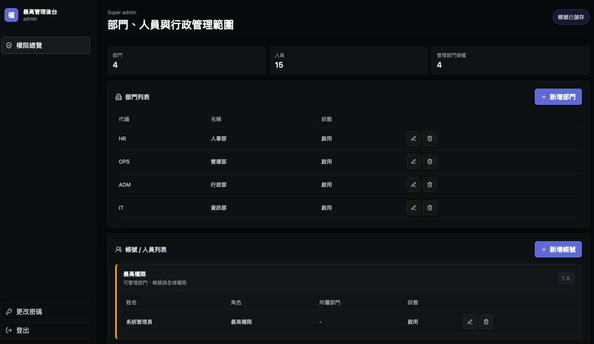
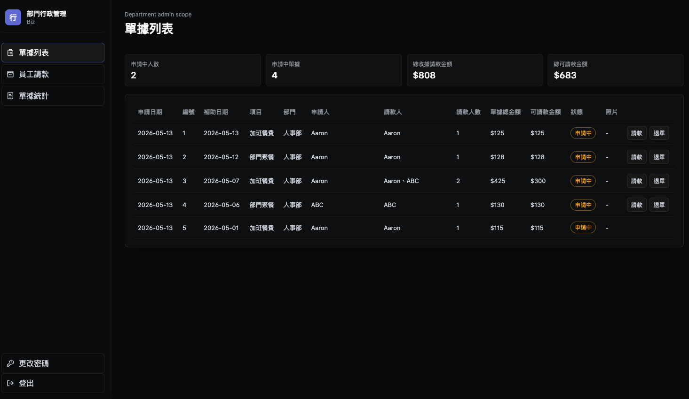
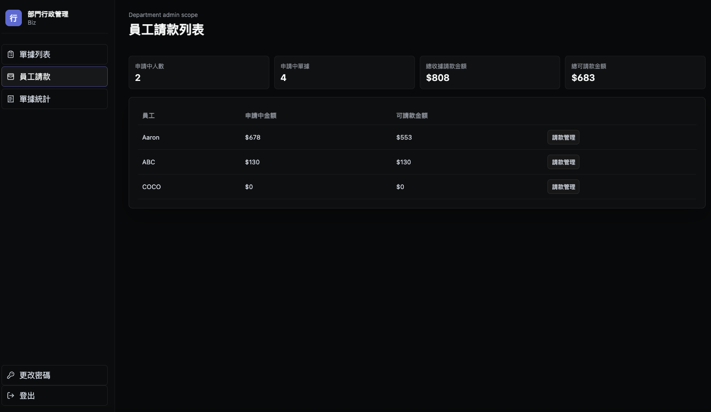
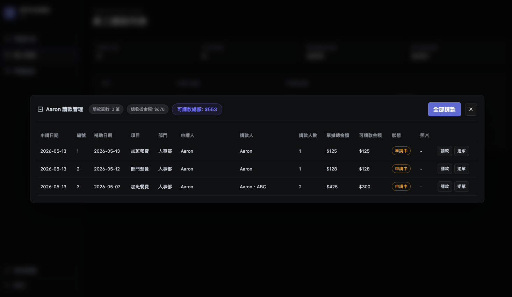
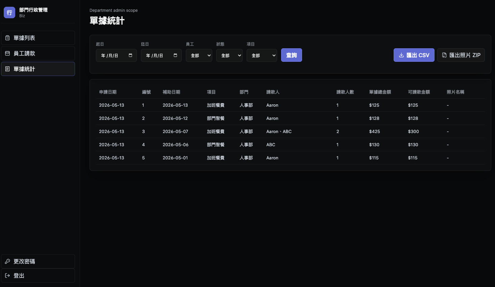
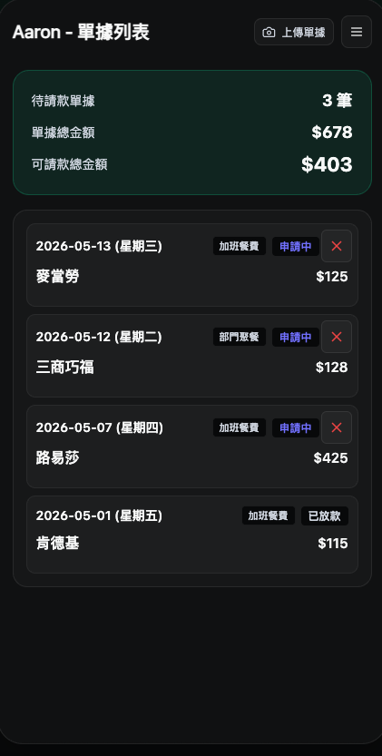
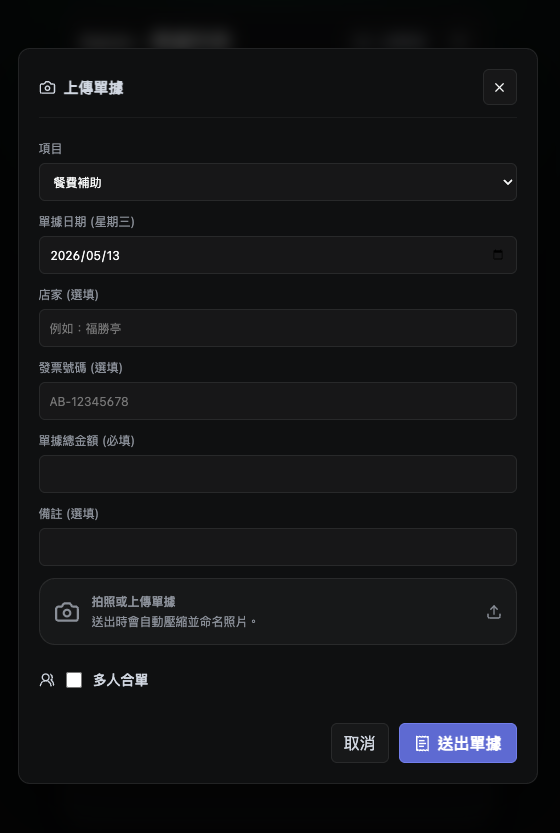

# 內部報銷管理系統 &nbsp; 

> 一套輕量、開源的企業內部**餐費補助報銷管理系統**，基於 Next.js 15 + Supabase 構建。
> 員工用手機拍照上傳單據，行政部門在後台一鍵核款——讓每日的午餐費用流程化繁為簡。

---

## ✨ 核心功能

- 📱 **手機優先的員工上傳介面**：針對行動裝置優化，員工可直接用手機拍照上傳餐飲收據
- 👥 **多人收據分攤**：支援單張收據多人手動分攤，自動計算每人當日補助上限
- 💰 **智能補助計算**：依「每人每日上限 150 元」規則自動計算可請款金額
- 🖼️ **收據影像上傳**：整合 Supabase Storage，支援照片上傳、自動壓縮與命名
- 📊 **財務統計與導出**：按員工彙總請款金額，支援 CSV 匯出供財務入帳使用
- ⚡ **批次核款**：行政人員可一次核准或退單，大幅提升管理效率

---

## 👤 三種角色權限說明

本系統採用三層角色架構，每種角色皆有獨立的登入入口與操作介面。

### 🔴 最高管理員（Super Admin）
**登入路徑：** `/login/super-admin`

負責全系統的組織架構與帳號管理，擁有最高權限。

| 功能 | 說明 |
|------|------|
| 部門管理 | 新增、編輯、刪除部門 |
| 帳號管理 | 建立員工與行政帳號、設定所屬部門與密碼 |
| 權限指派 | 設定部門行政的管轄範圍（可跨部門） |

> ⚠️ 刪除部門或帳號前，系統會自動檢查是否有關聯資料，若有未處理單據將阻擋刪除以保護資料完整性。

---

### 🟡 部門行政（Department Admin）
**登入路徑：** `/login`

負責審核所屬員工的單據，是主要的財務作業人員。

| 功能 | 說明 |
|------|------|
| 單據列表 | 查看所有員工的申請中單據，可個別核准（請款）或退單 |
| 員工請款 | 依員工彙總可請款金額，支援「全部請款」一鍵批次操作 |
| 單據統計 | 依日期、員工、類別等條件查詢歷史單據，匯出 CSV 或照片 ZIP |

---

### 🟢 員工（Employee）
**登入路徑：** `/login`

一般使用者，主要在手機上操作，上傳餐飲收據申請補助。

| 功能 | 說明 |
|------|------|
| 查看紀錄 | 查看個人所有單據與補助金額統計 |
| 上傳單據 | 拍照或選取圖片上傳收據，填寫金額與日期 |
| 多人合單 | 勾選同事共同分攤一張收據，各自填入請款金額 |
| 追蹤狀態 | 即時查看單據狀態（申請中 / 已放款 / 退單） |

> 📱 **員工介面針對手機優化**：彈窗表單、點擊區域與字體大小均依行動裝置設計，可直接在收據現場拍照送出。

---

## 📸 介面預覽

### 🔴 最高管理後台

管理所有部門與人員帳號，包含新增部門、建立帳號及設定管理授權範圍。



---

### 🟡 部門行政後台

#### 單據列表
查看所屬員工的所有申請中單據，可個別核准請款或退單，並查看附件照片。



#### 員工請款管理
依員工彙總可請款金額，點選「請款管理」展開該員工的所有單據，可一次全部請款。





#### 單據統計
依日期、員工、類別等條件篩選歷史單據，支援匯出 CSV 報表或照片 ZIP 壓縮包。



---

### 🟢 員工手機端

#### 單據列表
清楚列出個人所有單據，顯示待請款筆數與可請款總金額。



#### 上傳單據（手機拍照介面）
點選「上傳單據」後彈出表單，支援直接拍照或從相簿選取。送出後系統自動壓縮並命名照片。支援多人合單功能，勾選同事並分別填入各自的請款金額。



---

## 🛠 技術棧

| 類別 | 技術 |
|------|------|
| 框架 | Next.js 15 (App Router) |
| 語言 | TypeScript |
| 資料庫 | Supabase (PostgreSQL + RLS) |
| 存儲 | Supabase Storage |
| 樣式 | Vanilla CSS（響應式設計） |
| 圖標 | Lucide React |
| 部署 | Vercel / Docker |

---

## 🚀 快速開始

### 1. 本地開發

```bash
# 安裝依賴
npm install

# 複製環境變數範本
cp .env.example .env.local

# 啟動本地 Supabase（需先安裝 Supabase CLI）
supabase start

# 啟動開發伺服器
npm run dev
```

開啟 [http://localhost:3000](http://localhost:3000) 即可看到首頁。

### 2. 環境變數配置

```bash
# 系統加密密鑰
APP_SESSION_SECRET=your-random-session-secret
ADMIN_PASSWORD=your-super-admin-password

# Supabase 配置
NEXT_PUBLIC_SUPABASE_URL=https://your-project.supabase.co
NEXT_PUBLIC_SUPABASE_ANON_KEY=your-anon-key
SUPABASE_SERVICE_ROLE_KEY=your-service-role-key

# 補助金額上限（選填，預設 150 元）
DAILY_SUBSIDY_LIMIT=150
```

### 3. 初始化資料庫

在 Supabase SQL Editor 中，依序執行 `supabase/migrations/` 資料夾內的所有 `.sql` 檔案。

### 4. 建立 Demo 資料（選填）

```bash
# 清空資料庫（謹慎使用）
npx tsx --env-file=.env.local scripts/reset-db.ts

# 生成示範用的部門、帳號與單據資料
npx tsx --env-file=.env.local scripts/seed-demo-data.ts
```

Demo 帳號：
- **最高管理員**：`admin` / `admin`
- **部門行政**：`admin_行政` / `12345678`
- **一般員工**：`emp_行政_1` / `12345678`

---

## 📊 資料庫結構

| 資料表 | 說明 |
|--------|------|
| `profiles` | 帳號資訊、員工編號與角色 |
| `departments` | 部門主檔 |
| `receipts` | 收據主檔（日期、店家、金額、狀態） |
| `receipt_claims` | 收據分攤明細與補助金額計算 |
| `receipt_attachments` | 單據照片路徑 |
| `department_admin_departments` | 部門行政的管轄授權關聯 |
| `profile_credentials` | 自訂密碼登入憑證 |

---

## 📦 Docker 部署

```bash
# 建置 Image
docker build -t lunch-allowance .

# 啟動容器
docker run -d \
  --name lunch-allowance-app \
  -p 8080:3000 \
  -e NEXT_PUBLIC_SUPABASE_URL=https://your-project.supabase.co \
  -e NEXT_PUBLIC_SUPABASE_ANON_KEY=your-anon-key \
  -e SUPABASE_SERVICE_ROLE_KEY=your-service-role-key \
  -e APP_SESSION_SECRET=your-session-secret \
  lunch-allowance
```

---

## 📄 授權

本專案採用 [MIT License](LICENSE) 開源授權，歡迎自由使用與二次開發。

---

## 📝 Changelog

### v1.1.0 (2026-05-13)
- **修復**：最高管理後台編輯帳號後儲存無反應問題（外鍵約束錯誤 `23503 created_by`）
- **修復**：帳號更新時誤將 `onboarded_at` 重設的問題（現僅於新建帳號時設定）
- **修復**：員工後台多人合單驗證失敗後，送出按鈕永久卡住的問題（`isSubmitting` 未重置）
- **優化**：員工上傳單據彈窗縮減為手機適合的寬度（移除 `wide` class，max 520px）
- **新增**：`docs/screenshots/` UI 截圖目錄，用於 README 圖文說明
- **改寫**：README 全面重構，加入三種角色說明、手機優先特色說明與圖文截圖區
- **修正**：`seed-demo-data.ts` TypeScript null 型別檢查，確保 Docker build 成功

### v1.0.0 (2026-05-13)
首次正式開源發布。
- 移除 Google Sheets 整合，系統以 Supabase 為唯一資料來源
- 部門與帳號刪除改為硬刪除（有關聯資料時阻擋並提示）
- 刪除操作前加入 `confirm()` 確認彈窗
- 修正 Admin 後台側邊欄動態顯示登入帳號名稱
- 修正登入 Session 帳號 fallback 邏輯
- 最高管理後台側邊欄顯示登入者姓名與帳號
- 員工請款管理彈窗加入請款筆數與收據金額統計，並過濾僅顯示「申請中」狀態
